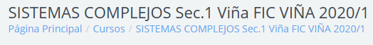

  

# ABM de Termitas
Repositorio para desarrollar proyecto semestral del ramo Sistemas Complejos.   

  

## Agentes

## Parametros

## Resultados

## Ayuda

**Comandos Git**  
git clone url_repo --> crea el repositorio local y descarga los archivos  
git status --> despliega el estado del repositorio local (cambios)
git add file_name --> al haber hecho cambios y querer subirlos al repositorio remoto, add es para agregar archivos a un commit
git commit -m "texto descriptivo" --> se guardan archivos cambiados en el commit bajo el texto descriptivo
git push --> sube los cambios al repositorio remoto
